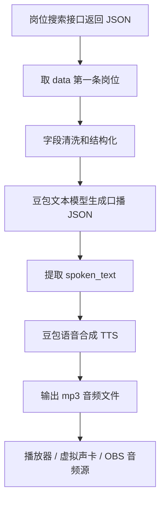

# 豆包查岗解说工作流

这个目录提供一个 Python 工作流脚本，用于把“岗位搜索接口返回 JSON”转换成直播间口播音频。

业务链路：



## 文件说明

- `job_narration_workflow.py`：主脚本，可直接运行，也可被你的任务队列 worker import。
- `requirements.txt`：Python 依赖。
- `examples/sample_job_response.json`：示例岗位接口返回。

脚本默认取固定字段：

```text
id, name, company_name, city, company_type_key, company_title_key,
start_time, end_time, recommendedMessage
```

同时会把常见扩展字段传给模型，例如：

```text
salary, experience, education, welfare, benefits, job_description,
description, address, district, job_type, tags, skill_tags
```

## 安装依赖

```bash
python3 -m venv .venv
.venv/bin/python -m pip install -r requirements.txt
```

## 环境变量

当前脚本会优先读取项目根目录 `.env`，也支持直接读取系统环境变量。真实 API Key 不再写在代码里；本地联调或正式部署时，请把凭证放到 `.env` 或 export 到当前 shell。

默认非敏感配置：

```text
LLM 模型：doubao-seed-2-0-lite-260215
TTS APP ID：1830992029
TTS Resource ID：volc.service_type.10029
TTS Voice：zh_female_wanqudashu_moon_bigtts
TTS HTTP URL：https://openspeech.bytedance.com/api/v3/tts/unidirectional
```

`.env` 中建议使用专用 key：

文案生成使用火山方舟的 OpenAI 兼容接口：

```bash
export DOUBAO_LLM_API_KEY="你的火山方舟 API Key"
export DOUBAO_LLM_MODEL="doubao-seed-2-0-lite-260215"
export DOUBAO_LLM_BASE_URL="https://ark.cn-beijing.volces.com/api/v3"
```

语音合成使用火山引擎豆包语音合成大模型-字符版，也就是控制台里的 BigTTS 服务：

```bash
export DOUBAO_TTS_API_KEY="控制台获取的 Access Key"
export DOUBAO_TTS_APP_ID="1830992029"
export DOUBAO_TTS_HTTP_URL="https://openspeech.bytedance.com/api/v3/tts/unidirectional"
export DOUBAO_TTS_RESOURCE_ID="volc.service_type.10029"
export DOUBAO_TTS_VOICE="zh_female_wanqudashu_moon_bigtts"
export DOUBAO_TTS_FORMAT="mp3"
export DOUBAO_TTS_SAMPLE_RATE="24000"
```

注意：`BigTTS...` 这类值通常是服务实例 ID，不一定是接口 header 里的 `X-Api-App-Id`。如果接口返回 401，请到控制台 FAQ 指引的位置查找真实的 APP ID 和 Access Token。

本项目当前已验证可用的接口 header 对应关系：

```text
X-Api-App-Id      -> DOUBAO_TTS_APP_ID
X-Api-Access-Key  -> DOUBAO_TTS_API_KEY
X-Api-Resource-Id -> DOUBAO_TTS_RESOURCE_ID
```

## 本地 dry run

不调用任何外部 API，只验证 JSON 提取和本地模板：

```bash
python3 job_narration_workflow.py \
  --input examples/sample_job_response.json \
  --dry-run \
  --script-only
```

## 正式生成口播文本

```bash
python3 job_narration_workflow.py \
  --input examples/sample_job_response.json \
  --script-only
```

## 生成语音文件

```bash
python3 job_narration_workflow.py \
  --input examples/sample_job_response.json \
  --output output/job_12345.mp3
```

如果你已经激活虚拟环境，也可以直接运行：

```bash
python job_narration_workflow.py \
  --input examples/sample_job_response.json \
  --output output/job_12345.mp3
```

成功后会输出类似：

```json
{
  "ok": true,
  "audio_path": "output/job_12345.mp3"
}
```

在 macOS 上生成后立即播放：

```bash
python3 job_narration_workflow.py \
  --input examples/sample_job_response.json \
  --output output/job_12345.mp3 \
  --play
```

## 从工作流接入

任务队列 worker 可以直接 import：

```python
from job_narration_workflow import (
    normalize_job,
    pick_first_job,
    generate_script_with_doubao,
    synthesize_with_doubao_tts,
    DoubaoLLMConfig,
    DoubaoTTSConfig,
)
```

推荐接入方式：

1. 弹幕识别出查岗意图后，查询后端岗位接口。
2. 把接口返回 JSON 传给 `pick_first_job()`。
3. 用 `normalize_job()` 得到干净的岗位字段。
4. 用 `generate_script_with_doubao()` 生成 `spoken_text`。
5. 用 `synthesize_with_doubao_tts()` 生成音频。
6. 把音频文件路径交给本地播放器、虚拟声卡或 OBS 媒体源。

## 输出结构

脚本会输出 JSON，方便上游服务读取：

```json
{
  "ok": true,
  "job": {},
  "narration": {
    "spoken_text": "现在打开的是上海的 Java开发工程师岗位...",
    "duration_level": "short",
    "should_play": true,
    "source": "doubao"
  },
  "audio_path": "output/job_12345.mp3"
}
```

## 注意事项

- 代码默认取 `data[0]`，需要保证小程序自动化也点开同一条岗位。
- 文案 prompt 明确要求不编造薪资、学历、经验、福利和风险。
- 直播正式使用前，建议把 TTS 输出接到虚拟声卡，由 OBS 或直播伴侣采集。
- 如果 TTS 返回 401，优先检查 `DOUBAO_TTS_APP_ID` 和 `DOUBAO_TTS_API_KEY` 是否来自豆包语音控制台，而不是火山方舟文本模型的 API Key。
- 不要把真实 API Key 写回代码或提交到仓库；放在项目根目录 `.env` 即可。
